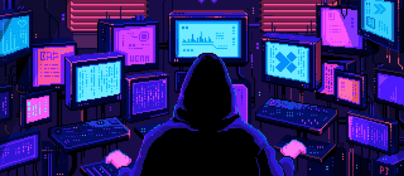

## Hello World! 👋✨

Desenvolvedor de Software desde 2022, possuo ampla experiência em desenvolvimento web Front-End. Estou constantemente aprimorando minhas habilidades e aprendendo novas tecnologias, bibliotecas e frameworks para criar aplicações com as melhores experiências e soluções. Além disso, sou entusiasta de cibersegurança e nas horas vagas gosto de jogar games, ler livros e assistir filmes e séries.

* 🌱 Atualmente estou estudando **React**.
* 🚀 Meu Objetivo no futuro e me tornar um **Desenvolvedor FullStack**.
* 🧑‍💻 Sou Técnico em **Redes de Computadores** pelo **IMD/UFRN**.
* 🎓 Estou cursando **Engenharia de Software** na **Estácio**.
* 🏆 Embaixador DIO Campus Expert!
* 💬 Me pergunte sobre **JavaScript**.
* 🔍 Veja meus projetos do [**Frontend Mentor**](https://www.frontendmentor.io/profile/Fransuelton)!

 

## Tech Stack 💻

<b>Desenvolvimento FrontEnd 🎨</b>

 

<b>Desenvolvimento BackEnd ⚙️</b>

 

<b>Ferramentas 🔧</b>

 

<b>Outros 🔍</b>

 

### GitHub Stats ⚡

### GitHub Streak 🔥

